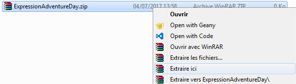
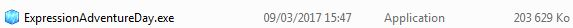
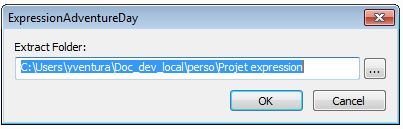
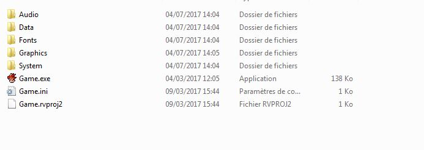

# ExpressionAdventureDay

## Introduction

J'ai créé ce jeu durant ma première année de Master ICE ( Informatique Collaborative en Entreprise ) afin de présenter mes projets profesionnels, mes parcrous et ma personnalité.
Ce projet a été créer à partir du logiciel RPG Maker VX Ace. Ainsi, seuls l'archive finale du jeu ainsi que le projet rpgmaker seront mis à disposition sur cette page.

________________________________________________________________________________________________________________________________________

I made this game during my first year of Master Degree to present my personal and professional projets.This funny game is an interactive way to present my CV.
This project was created with RPG Maker VX Ace, so only the final game and the rpgmaker file will be presented.

## Guide d'installation

1. Télécharger le jeu : https://drive.google.com/open?id=0B4Br5hCpFMNNQmk3WDNDRjFDdE0

2. Extraire l'archive

3. Double cliquez sur l'exécutable

4. Choisir le répertoire d'installation

5. Ouvrir le répertoire du jeu et exécuter le fichier : Game.exe

## Installation guide

1. Download the game : https://drive.google.com/open?id=0B4Br5hCpFMNNQmk3WDNDRjFDdE0

2. Extract the archive file

3. Run the executable file

4. Choose the repository you want to install the game

5. Open the repository and launch : Game.exe

## Conception des niveaux et points d'intérets
Ayant des contraintes de temps sur ce projet, j’ai choisi dans ce dernier de ne répartir mes expériences que sur 3 cartes différentes représentants chacune une étape de ma vie étudiante.
    1.	Ma chambre chez mes parents
    2.	Ma première chambre étudiante
    3.	Mon appartement actuel
    
Chaque carte propose au joueur de chercher un ou plusieurs objets dans une pièce. Le jeu est rythmé par divers dialogues permettant de découvrir certaines étapes clés de mon parcours mais aussi, mes passes temps et ma personnalité.

Sur la capture d’écran suivante chaque carré transparent représente un évènement se déclenchant automatiquement ou via une action du joueur.
Ces évènements sont en vérité du code rubis générer par le logiciel RPG Maker. Côté utilisateur, j’ai effectué très peu d’efforts en programmation afin de pouvoir concevoir les divers niveaux du jeu. En revanche une bonne gestion des évènements et de leurs déclencheurs ont été nécessaire afin de garantir l’avancée du joueur. Les ressources utilisées durant ce jeu sont principalement celles fournies de base par le logiciel RPG Maker VX Ace, cependant il m’a été nécessaire d’importer de nouvelles ressources graphiques (trouvé en accès libre sur internet) afin de pouvoir représenter divers ordinateurs.

<scr_1>

## 2011 – Chambre de Yannis en Martinique

Afin de progresser sur cette première carte le joueur devra trouver divers indices concernant mes origines et mes centres d’intérêt. Trois indices sont nécessaires afin d’ouvrir la porte permettant d’accéder à la prochaine carte.

<src_2>

Une fois les divers indices découverts le joueur peut ainsi avancer dans le jeu.
Il est important de noter qu’il y a plus d’évènements que nécessaire afin de s’assurer que le joueur ne passe pas trop de temps à chercher et puisse avancer rapidement dans les divers niveaux du jeu.
L’un des aspects importants de ce projet est de favoriser à minima la jouabilité du titre.
Ainsi un joueur pressé ne fera pas le jeu à 100% et pourrait découvrir de nouvelles choses en rejouant une nouvelle fois. Il en est de même pour les autres cartes.

## 2016 Appartement Toulouse

Ce niveau représente l’un de mes premiers appartements étudiants. Le joueur aura ici pour mission de retrouver les clés de l’appartement afin de pouvoir sortir du niveau. Le but de cette démarche est de forcer le joueur à explorer l’appartement à la recherche dudit objet. En explorant les diverses pièces le joueur découvrira alors divers indices sur mes motivations, mais également sur ma personnalité.

<src_3>

## 2017 Appartement

La troisième et dernière carte du jeu est aussi la plus grande. Bien qu’à l’échelle l’appartement serait un véritable château. J’ai voulu ici marquer le fait de sortir d’un petit appartement.
Lors de la création de ce projet j’étais encore en train d’aménager mon appartement. Cette carte est donc en quelque sorte un mélange entre mon appartement actuel et ce que je souhaitais faire de ce dernier.
Le but de la dernière carte est de récupérer le CV poser sur le table afin de pouvoir l’envoyé par mail sur l’ordinateur disponible dans la pièce. 
Une fois cette dernière tâche accomplit mon CV (de fin d’année de master 1) apparaitra alors à l’écran du joueur sous forme de texte défilé plus sous forme d’un QR code que le joueur pourra scanner avec son téléphone portable afin d’avoir accès au PDF correspondant à mon CV.

