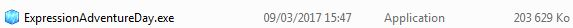

# ExpressionAdventureDay

## Introduction

J'ai créer ce jeu durant ma première année de Master ICE ( Informatique Collaborative en Entreprise ) afin de présenter mes projets profesionnels, mes parcrous et ma personnalité.
Ce projet à été créer à partir du logiciel RPG Maker VX Ace. Ainsi, seule l'archive finale du jeu ainsi que le projet rpgmaker seront mis à dispocition sur cette page.

## Guide d'installation.

1. Télécharger le jeu : https://drive.google.com/open?id=0B4Br5hCpFMNNQmk3WDNDRjFDdE0

2. Extraire l'archive

3. Double cliquez sur l'exécutable

4. Choisir le répertoire d'installation

5. Ouvrir le répertoire du jeu et exécuter le fichier : Game.exe

